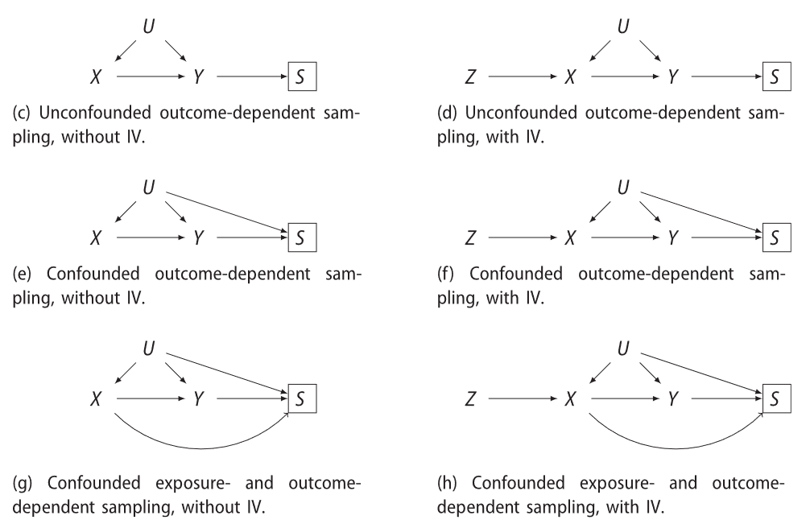
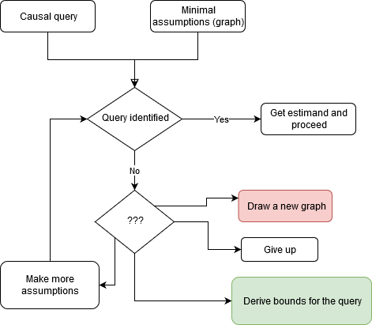
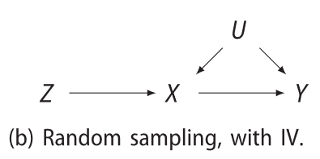
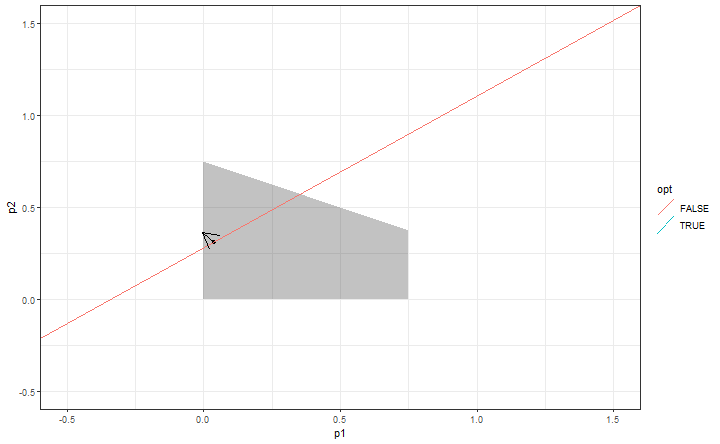
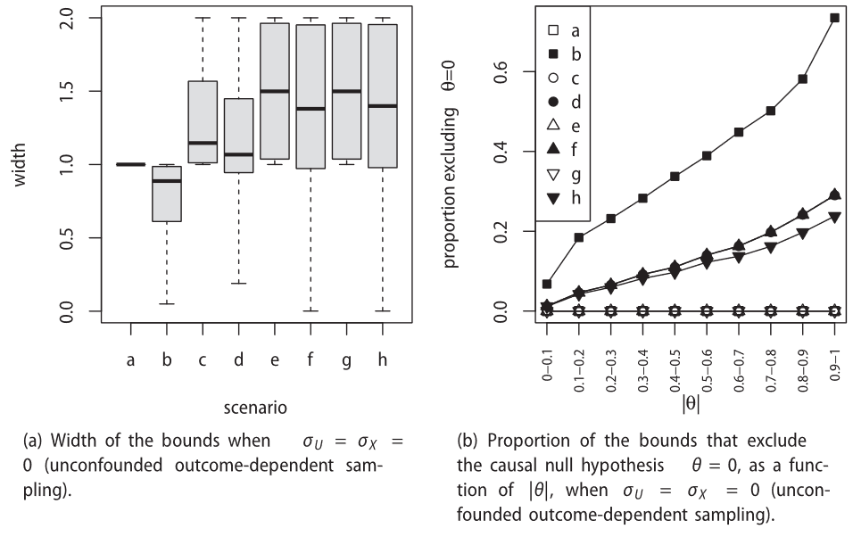

```{r setup, include=FALSE}
options(htmltools.dir.version = FALSE)
library(knitr)
library(leaflet)
opts_chunk$set(echo = FALSE, fig.width = 10, fig.height = 10 * .618, 
               fig.align = "center")

```

# About Me

- I am from Upstate New York (lots of cows, no sky-scrapers)
- I moved to Sweden in 2016, two days before Trump was elected 
- I have two small dogs that are my only children 

```{r, echo=FALSE}
plcs <- matrix(c(
42.4440, -76.5019,
39.2182, -76.0696,
45.5048, -73.5772,
47.65469, -122.3183384,
#38.99, -77.1,
59.3251172, 18.0710935 
), ncol = 2, byrow = TRUE)
plcs <- as.data.frame(plcs)
colnames(plcs) <- c("lat", "lng")

Icons <- iconList(
ithaca = makeIcon("ithaca.png", "ithaca.png", 40, 80),
washcol = makeIcon("washcol.png", "washcol.png", 80, 40),
mcgill = makeIcon("Mcgill.png", "Mcgill.png", 40, 40),
UW = makeIcon("UW.png", "UW.png", 40, 40),
#nci = makeIcon("NIH.png", "NIH.png", 80, 40),
ki = makeIcon("ki.png", "ki.png", 80 , 40)
)
plcs$icon <- Icons

leaflet(data = plcs, width = "100%") %>% setView(lat = 50, lng = -50, zoom = 3) %>% addTiles() %>% addMarkers(~lng, ~lat, icon = ~icon)%>%
addEasyButton(easyButton(
icon="fa-crosshairs", title="Locate Me",
onClick=JS("async function(btn, map){ 

var nihicon = L.icon({
    iconUrl: 'NIH.png',
    iconSize: [80, 40]
});

               var line = L.polyline([[42.4440, -76.5019],
            [39.2182, -76.0696],
            [45.5048, -73.5772] ], 
            {snakingSpeed: 50});
                map.flyTo([40, -75], 5, {animate: true, duration: .75});
                line.addTo(map).snakeIn();
                
                var line2 = L.polyline([
            [45.5048, -73.5772],
            [47.65469, -122.3183384],
            [38.99, -77.1] ], 
            {snakingSpeed: 100});
            await sleep(6000);
                line2.addTo(map).snakeIn();
              map.flyTo([42, -85], 4, {animate: true, duration: .5});
              
              L.marker([38.99, -77.1], {icon: nihicon}).addTo(map);
              
                var line3 = L.polyline([
            [38.99, -77.1],
            [59.3251172, 18.0710935] ], 
            {snakingSpeed: 100});
            await sleep(11000);
                line3.addTo(map).snakeIn();
              map.flyTo([50, -50], 3, {animate: true, duration: .5});
                }")))
```
---

# My other Biostatistics research

Surrogate evaluation 

- Principal stratification framework
  - Peter Gilbert, Dean Follmann, Betz Halloran, Michael Sachs
- Meta-analysis multiple trial framework 
  - Michael Daniels, Betz Halloran, Michael Sachs
  
Machine learning for survival outcomes 

- IPCW bootstrap
  - **Pablo Gonzalez Ginestet**, Julian Wolfson
- Pseudo-observations, superlearner, Megalearner, CNN
  - Michael Sachs, **Pablo Gonzalez Ginestet**

  
---

# My other Biostatistics research

Trial designs 

- Exact tests for challenge trials 
  - Michael Fay, Martha Nason, Dean Follmann
- Test-negative 
  - **Iuliana Ciocanea-Teodorescu**, Martha Nason, Arvid Sjölander
- Biomarker evaluation
  - **Adam Brand**, Michael Sachs, Arvid Sjölander

Causal inference

- Sensitivity analysis 
  - **Iuliana Ciocanea-Teodorescu**, Arvid Sjölander
- Interference 
  - Dean Follmann
- Cautionary tales
  - Arvid Sjölander, Michael Fay, Sander Greenland, Jamie Robins, Dean Follmann
- Nonparametric bounds
  - Michael Sachs, Arvid Sjölander

---


# My collaborative work 

Clinical trials 
  - Malaria Vaccine (Phase I-IIb), TB, HIV, prostate cancer, Mental health
  
Large cohort studies 
  - Zika, Malaria, HIV, COVID-19 deaths Sweden
  
Smaller observational studies 
  - COVID-19 in the elderly, COVID-19 prognostic biomarker


---
class: inverse, center, middle


# Back to the bounds!


---


class: inverse, center, middle


# Motivation

---

# Register based causal inference

In register studies, there is interest in the causal effect of an exposure $X$ on an outcome $Y$.

- Often, the outcome is a diagnosis in a register 
- Many register studies are variations on case-control studies

This is __outcome dependent sampling__

Does sampling depend _only_ on the outcome? 

- Since sampling based on _diagnosis_, may depend on healthcare seeking behavior (unobserved)
- Diagnosis of another diseases may coincide with the disease of interest or the exposure (observed)

---

# Test-negative designs in Phase IV 

We want to obtain some RWE of effectiveness rather than efficacy 

- test-negative designs are by their nature outcome-dependent samples 
- Although the idea is that this design reduces unmeasured confounding, it may not

This is outcome-dependent and confounded sampling in the worst case scenario

Regardless, we know sampling depends on more than the outcome.  


---


# Outcome dependent sampling

```{r, out.width = "80%"}

```

---

class: inverse, center, middle

# Background

---

# The Identification Problem is Solved

Given a graph and a causal query, there is an algorithm to determine whether that query is estimable. If so, the algorithm returns an estimand in terms of observables. 

The algorithm is complete, meaning, _if a query is identifiable_, there exists a sequence of applications of the _3 rules of do calculus_ that transforms the query into a formula that only includes observable quantities, and the algorithm can find them in finite time. 

# Pearl's recipe

1. Commit to a graph
2. Specify a causal query
3. (allow algorithm to) Determine whether query is identified
4. If so, determine estimand in terms of observables
5. Specify statistical model to get an estimator
6. Fit the model

---

# If the query is not identified? 


```{r}

```

---

# Balke and Pearl 1994

```{r}

```

For measured binary variables $\mathcal{V} = \{Z, X, Y\}$, and with arbitrary unmeasured confounders $U$

- This is a functional causal model $\{F_V:pa(V)\times U_V\to V\mid V\in\mathcal{V}\}$
- $\theta = p\{Y(X = 1) = 1\} - p\{Y(X = 0) = 1\}$ is not identified
- Balke and Pearl derived bounds for $\theta$ with no additional assumptions using linear programming

---


# Linear Programming

In linear cases, for $p$ the observable probabilities and $q$ the unobservable response function probabilities, we have 
$$p=Rq\text{ for some matrix }R\in\{0,1\}^{k\times p}$$
Further, we can express potential outcomes of $Y$ under intervention on $X$ in terms of the parameters $q$ by the adjustment formula; $$P(y|do(x))=\sum_{r_X,r_Y}P(y|x,r_Y)q_{(r_X,r_Y)}$$
Hence, we have 
$$\begin{align*}
\theta
&=P(Y(X = 1) = 1)-P(Y(X = 0)=1)\\
&=c^Tq\text{ for some vector }c\in\{0,1,-1\}^{k\cdot p}
\end{align*}$$

---


# Linear Programming

Now we have our constraints on $q$ as well as our effect of interest in terms of $q$ and we are ready to optimize! The following LP gives a tight lower bound on $\theta$: 
$$\begin{matrix}
\min&c^Tq\\
st&\Sigma q=1\\
\&&Rq=p\\
\&&q\geq0
\end{matrix}$$

We cannot solve this symbolically because the $q$ s are unknown. Instead we convert to the dual problem. 

By *the Strong Duality Theorem* of convex optimization, the optimal value of this primal problem equals that of its dual. 

Furthermore, its constraint space is a convex polytope and by *the Fundamental Theorem of Linear Programming*, this optimum is attained at one of its vertices. 

Thus, we enumerate the vertices of the dual problem which are in terms of the $p$ s. 

---


Consider the objective $Q = p_1 q_1 + p_2 q_2$, and constraints (of the dual) $p_1, p_2 \geq 0$; $p_1 \leq 0.75$; $p_2 \leq -0.5 p_1 + 0.75$.


 
We use the _Double description method_ as implemented in `cddlib` (very fast!)
---

```{r, out.width = "80%"}

```
---

class: inverse, center, middle

# Problems

---

# What goes wrong with non-linearity?

- Non-linear objective function: 
    + Gradient is not constant
    + "The marble is rolling around on a curved surface"
- Non-linear constraints
    + Feasible space may be non-convex -> local optima
    + Feasible space may be curved -> infinitely many corners, can't enumerate them


---

# Our solutions


### For DAGs with unconfounded outcome-dependent sampling

- Start with the DAG without $S$ that is linear
- Compute bounds under that DAG
- Expand to incorporate the sampling

This yields valid but *not tight* bounds

### For DAGs with confounded outcome-dependent sampling

Modifications to the linear programming

1. Sampling variable $S$ is part of the observables
2. Only observed probabilities where $S = 1$
3. Derive constraints based on these observables

This yields *tight* bounds

---


class: center, middle, inverse

# Results

---

# Theoretical Findings

- We present valid bounds on the $\theta$ for all scenarios
- Bounds are the tightest possible assumption-free bounds for the linear cases
- Develop a somewhat general strategy for deriving valid bounds in nonlinear cases

# Computational advancements

- These algorithms work for more general classes of causal problems 
- We have implemented an interface to them in an `R` package `causaloptim` 
- This uses `rcdd` for vertex enumeration which is very fast and well-tested

---

# Empirical Findings

```{r, out.width = "75%"}

```

scenarios a,b are random sampling
---


class: center, middle, inverse

# Conclusion

---

## Summary

- We provide bounds under all of these scenarios

- They are useful in practice when causal inference is the goal of a study

- The expressions for the bounds give insight to different study designs


---

## The bounds are too wide to be useful!

Randomized trials with non-compliance and drop-out 

A Peanut allergy study with drop-out and non-compliance, Du Toit et al. (2015) 

- Found a positive effect of peanut exposure on reducing allergic reactions 

- They did not attempt to account for non-compliance or drop-out and estimate the effect of treatment 

- They did a worst-case imputation and found the ITT effect was still positive 

Gabriel et al (2021) used bounds for the treatment effect allowing for non-compliance and potentially outcome-dependent drop-out and still found that the effect was bounded below zero, or reducing the risk of reaction. 


---

## Bounds are not just for significant effects

The Danish Mask Study Bundgaard et al. (2021)

- Null findings, likely because the effect was smaller than the study was powered for 
- Reported 95% CI, suggesting that the results if they exist could not be that large
- There was non-compliance (~54% in treatment group, unknown in control) and drop-out (~20%)

Gabriel & Sachs (2021), in a short communication in AJE, compute bounds based on summary statistics reported in the paper

- The bounds include effects much larger and smaller than the 95% CI suggest 

Although in this case it is unlikely that the estimates are as large as the bounds suggest at the upper bound, it does give a better idea of the uncertainty in the results, not just due to sampling. 

---

## Other issues I did not talk about

- Multicategorical variables (coming soon!)

- Mediation estimands with multiple mediators (coming soon!)

- Estimation of the bounds and uncertainty due to sampling 

- Ongoing development of `causaloptim`

Thank you!

---

## References 

Erin E. Gabriel, Michael C. Sachs & Arvid Sjölander (2020) Causal Bounds for Outcome-Dependent Sampling in Observational Studies, Journal of the American Statistical Association, DOI: 10.1080/01621459.2020.1832502

Erin E. Gabriel, Arvid Sjölander & Michael C. Sachs (2021) Nonparametric Bounds for Causal Effects in Imperfect Randomized Experiments, Journal of the American Statistical Association, DOI: 10.1080/01621459.2021.1950734

Erin E. Gabriel, Michael Sachs (2021) On the use of nonparametric bounds for causal effects in null randomized trials, American Journal of Epidemiology, DOI: 10.1093/aje/kwab153.

Du Toit, G., Roberts, G., Sayre, P. H., Bahnson, H. T., Radulovic, S., Santos, H., Brough, A., Phippard, D., Basting, M., Feeney, M. (2015), “Randomized Trial of Peanut Consumption in Infants at Risk for Peanut Allergy,” The New England Journal of Medicine, 372, 803–813. DOI: 10.1056/NEJMoa1414850. 

Bundgaard   H, Bundgaard   JS, Raaschou-Pedersen   DET, et al.   Effectiveness of adding a mask recommendation to other public health measures to prevent SARS-CoV-2 infection in Danish mask wearers—a randomized controlled trial. Ann Intern Med. 2021;174(3):335–343.
